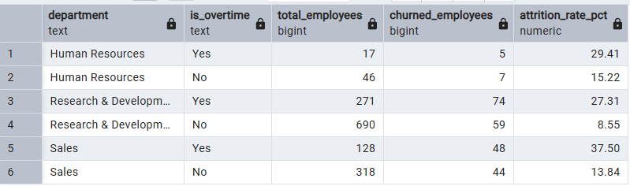
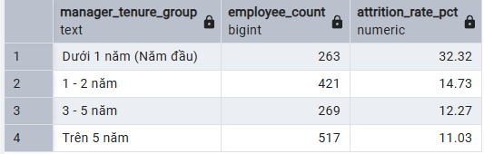
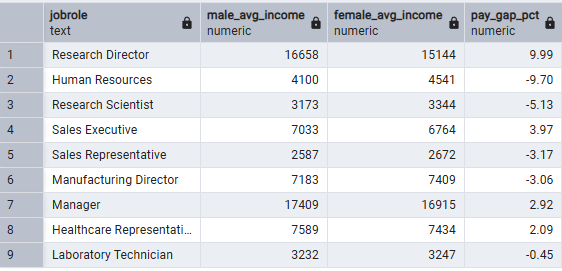
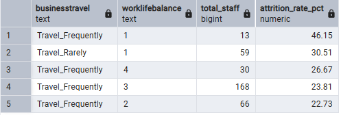
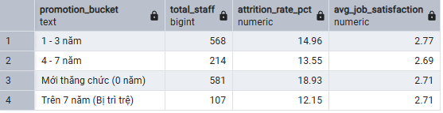
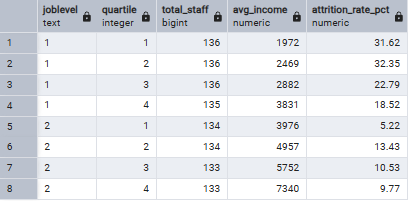
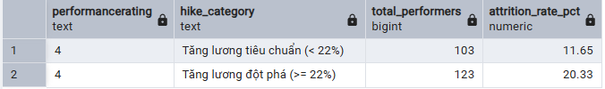
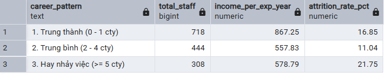

HR ANALYTICS

### 1. Tác động của Overtime đến tỷ lệ nghỉ việc theo từng phòng ban ?

```sql
SELECT
	department,
	CASE WHEN overtime = 1 THEN 'Yes' ELSE 'No' END AS is_overtime,
	COUNT(*) AS total_employees,
	SUM(attrition) AS churned_employees,
	ROUND(AVG(attrition) * 100.0, 2) AS attrition_rate_pct
FROM hr_analytics_cleaned
GROUP BY department, overtime
ORDER BY department, is_overtime DESC;
```

### Output:



### Insight:
- Số liệu: Nhân viên làm thêm giờ (OT) có tỷ lệ nghỉ việc cao vượt trội ở mọi phòng ban: Sales OT đạt 37.50% (so với 13.84% không OT), R&D OT đạt 27.31% (gấp hơn 3 lần nhóm không OT: 8.55%), và Human Resources OT đạt 29.41% (so với 15.22% không OT).

- Ngữ cảnh: Khối Sales và R&D chịu áp lực chỉ tiêu doanh số và deadline nghiên cứu liên tục; việc tăng ca kéo dài mà thu nhập trung bình không có sự bù đắp vượt bậc khiến nhân sự rơi vào trạng thái kiệt sức (burnout).

- Hành động: Đánh giá lại định mức KPI, thiết lập chính sách giới hạn số giờ OT trần hàng tháng và áp dụng cơ chế nghỉ bù (compensatory leave) hoặc thưởng dự án trực tiếp cho khối R&D và Sales.

### 2. Mỗi liên hệ giữa số năm làm việc với Quản lý trực tiếp và nguy cơ nghỉ việc

```sql
SELECT
	CASE
		WHEN yearswithcurrmanager = 0 THEN 'Dưới 1 năm (Năm đầu)'
		WHEN yearswithcurrmanager BETWEEN 1 AND 2 THEN '1 - 2 năm'
		WHEN yearswithcurrmanager BETWEEN 3 AND 5 THEN '3 - 5 năm'
	ELSE 'Trên 5 năm'
	END AS manager_tenure_group,
	COUNT(*) AS employee_count,
	ROUND(AVG(attrition) * 100.0, 2) AS attrition_rate_pct
FROM hr_analytics_cleaned
GROUP BY 1
ORDER BY attrition_rate_pct DESC;
```

### Output:


### Insight:
- Số liệu: Nhóm nhân sự làm việc với người quản lý hiện tại dưới 1 năm có tỷ lệ thôi việc lên tới 32.32% (gần 1/3 nhân sự ra đi), trong khi nhóm làm việc từ 3-5 năm giảm xuống còn 12.27% và trên 5 năm chỉ còn 11.03%.

- Ngữ cảnh: Giai đoạn thay đổi hoặc tiếp nhận quản lý mới tạo ra "cú sốc" về phong cách lãnh đạo, đứt gãy giao tiếp và thiếu sự thấu hiểu/tin tưởng trong năm đầu tiên ("nhân viên không bỏ việc, họ bỏ sếp").

- Hành động: Tập trung đào tạo năng lực quản lý con người cho cấp Leader, tối ưu quy trình bàn giao/chuyển tiếp nhân sự (Manager Onboarding) trong 90 ngày đầu và triển khai các buổi 1-on-1 định kỳ có HRBP hỗ trợ.

### 3. Phân tích khoảng cách thu nhập theo giới tính (Gender Pay Gap) ở từng vị trí

```sql
WITH salary AS (
    SELECT
        jobrole,
        AVG(monthlyincome) FILTER (WHERE gender = 'Male') AS male_income,
        AVG(monthlyincome) FILTER (WHERE gender = 'Female') AS female_income
    FROM hr_analytics_cleaned
    GROUP BY jobrole
)
SELECT
    jobrole,
    ROUND(male_income) AS male_avg_income,
    ROUND(female_income) AS female_avg_income,
    ROUND((male_income - female_income) * 100 / NULLIF(female_income, 0), 2) AS pay_gap_pct
FROM salary
ORDER BY ABS((male_income - female_income) / NULLIF(female_income, 0)) DESC;
```

### Output:


### Insight:
- Số liệu: Vị trí Research Director ghi nhận Nam giới có thu nhập trung bình cao hơn Nữ giới 9.99% ($16,658 vs $15,144). Ngược lại, ở khối Human Resources, Nữ giới nhận mức lương cao hơn Nam giới 9.70%.

- Ngữ cảnh: Sự chênh lệch tại cấp Director chịu ảnh hưởng từ thâm niên lịch sử khi tuyển dụng đầu vào, trong khi vị trí HR có tỷ lệ nhân sự nữ giữ các vai trò chuyên môn thâm niên cao hơn.

- Hành động: Chuẩn hóa dải lương (Salary Bands) dựa trên năng lực và hiệu suất thực tế thay vì lịch sử lương cũ, thực hiện rà soát và điều chỉnh lương định kỳ cho cấp quản lý để đảm bảo chuẩn mực công bằng nội bộ (Pay Equity).

### 4. Nhận diện "Điểm nóng" nhân viên nghỉ việc do Đi công tác & Mất cân bằng cuộc sống

```sql
SELECT
	businesstravel,
	worklifebalance,
	COUNT(*) AS total_staff,
	ROUND(AVG(attrition) * 100.0, 2) AS attrition_rate_pct
FROM hr_analytics_cleaned
GROUP BY businesstravel, worklifebalance
HAVING COUNT(*) >= 10
ORDER BY attrition_rate_pct DESC
LIMIT 5;
```

### Output:


### Insight:
- Số liệu: Nhóm nhân sự vừa phải công tác thường xuyên (Travel_Frequently) vừa có mức Work-Life Balance kém (Mức 1) có tỷ lệ nghỉ việc cao kỷ lục toàn công ty là 46.15%. Nhóm công tác ít (Travel_Rarely) nhưng WLB Mức 1 cũng ghi nhận tỷ lệ nghỉ việc 30.51%.

- Ngữ cảnh: Việc di chuyển liên tục kết hợp với thiếu thời gian tái tạo sức lao động dẫn đến sự quá tải về mặt thể chất lẫn tinh thần, đẩy nhanh quyết định rời bỏ tổ chức.

- Hành động: Thiết lập trần giới hạn số ngày công tác mỗi quý cho từng cá nhân, đồng thời áp dụng chính sách làm việc từ xa (Work From Home) linh hoạt 1-2 ngày sau các đợt công tác dài ngày.

### 5. Thâm niên không được thăng thức (Promotion Stagnation) và mức độ hài lòn

```sql
SELECT 
    CASE 
        WHEN yearssincelastpromotion = 0 THEN 'Mới thăng chức (0 năm)'
        WHEN yearssincelastpromotion BETWEEN 1 AND 3 THEN '1 - 3 năm'
        WHEN yearssincelastpromotion BETWEEN 4 AND 7 THEN '4 - 7 năm'
        ELSE 'Trên 7 năm (Bị trì trệ)'
    END AS promotion_bucket,
    COUNT(*) AS total_staff,
    ROUND(AVG(attrition) * 100.0, 2) AS attrition_rate_pct,
    ROUND(AVG(CAST(jobsatisfaction AS INT)), 2) AS avg_job_satisfaction
FROM hr_analytics_cleaned
GROUP BY 1
ORDER BY promotion_bucket;
```

### Output:


### Insight:
- Số liệu: Nhóm nhân sự vừa được thăng chức trong năm (0 năm) có tỷ lệ nghỉ việc cao nhất (18.93%), giảm dần ở nhóm 1-3 năm (14.96%) và ổn định nhất ở nhóm thâm niên trên 7 năm không thăng chức (12.15%). Điểm hài lòng công việc giữa các nhóm duy trì đồng đều quanh mức ~2.7.

- Ngữ cảnh: Sau khi được thăng chức, giá trị hồ sơ của nhân sự tăng cao trên thị trường lao động, khiến họ trở thành đối tượng mục tiêu hàng đầu của các công ty săn đầu người (headhunter) với các chế độ hấp dẫn hơn.

- Hành động: Gắn liền quyết định thăng chức với các chính sách cam kết giữ chân nhân tài dài hạn (Retention Bonus, mở khóa cổ tức/cổ phiếu theo kỳ) cùng kế hoạch mở rộng quyền tự chủ thực tế trong công việc.

### 6. Phân tích Tứ phân vị Thu nhập (Income Quartile) trong từng Cấp bậc công việc

```sql
WITH q AS (
    SELECT *,
           NTILE(4) OVER (PARTITION BY joblevel ORDER BY monthlyincome) AS quartile
    FROM hr_analytics_cleaned
)
SELECT
    joblevel,
    quartile,
    COUNT(*) AS total_staff,
    ROUND(AVG(monthlyincome)) AS avg_income,
    ROUND(AVG(attrition) * 100, 2) AS attrition_rate_pct
FROM q
WHERE joblevel IN ('1', '2')
GROUP BY joblevel, quartile
ORDER BY joblevel, quartile;
```

### Output:


### Insight:
- Số liệu: Tại Job Level 1 (Junior/Entry-level), hai nhóm thu nhập đáy (Quartile 1 & 2 với mức lương dưới $2,500/tháng) có tỷ lệ nghỉ việc lên tới ~32% (31.62% và 32.35%), cao gần gấp đôi nhóm nhận lương cao nhất cùng cấp (Quartile 4: 18.52%).

- Ngữ cảnh: Mức lương dưới $2,500 không đủ cạnh tranh với chi phí sinh hoạt và mặt bằng thị trường, khiến nhân viên mới dễ dàng chuyển việc khi nhận được các lời mời có mức lương khởi điểm tốt hơn.

- Hành động: Tái cấu trúc sàn lương cho Job Level 1 lên mức tối thiểu cạnh tranh (từ $2,800/tháng) và áp dụng cơ chế đánh giá tăng lương nhanh 6 tháng/lần cho nhân sự mới hoàn thành tốt công việc.

### 7. Nghịch lý giữ chân Nhân sự Hiệu suất xuất sắc (Top Performers Flight Risk)

```sql
SELECT
	performancerating,
	CASE
		WHEN percentsalaryhike < 22 THEN 'Tăng lương tiêu chuẩn (< 22%)'
		ELSE 'Tăng lương đột phá (>= 22%)'
	END AS hike_category,
	COUNT(*) AS total_performers,
	ROUND(AVG(attrition) * 100.0, 2) AS attrition_rate_pct
FROM hr_analytics_cleaned
WHERE performancerating = '4'
GROUP BY performancerating, 2;
```

### Output:


### Insight:
- Số liệu: Trong nhóm nhân sự hiệu suất xuất sắc (Rating = 4), những người nhận mức tăng lương đột phá ($\ge 22\%$) có tỷ lệ nghỉ việc lên đến 20.33%, cao hơn đáng kể nhóm chỉ tăng lương tiêu chuẩn (11.65%). Tỷ lệ nghỉ việc trung bình toàn nhóm Top Performer ở mức ~16.4%.

- Ngữ cảnh: Top Performers thường phải gánh khối lượng công việc và trách nhiệm lớn; việc chỉ bù đắp bằng tiền mặt mà thiếu sự hỗ trợ nguồn lực hoặc lộ trình phát triển dài hạn vẫn khiến họ quyết định rời đi do quá tải.

- Hành động: Đa dạng hóa hình thức giữ chân nhân sự nòng cốt: kết hợp tăng lương với việc trao quyền sở hữu cổ phần (stockoptionlevel), cấp trợ lý/nhân sự hỗ trợ dự án và xây dựng lộ trình sự nghiệp rõ ràng.

### 8. Thói quen nhảy việc (Job Hoppers) và Tốc độ gia tăng thu nhập

```sql
SELECT
	CASE
		WHEN numcompaniesworked <= 1 THEN '1. Trung thành (0 - 1 cty)'
		WHEN numcompaniesworked BETWEEN 2 AND 4 THEN '2. Trung bình (2 - 4 cty)'
		ELSE '3. Hay nhảy việc (>= 5 cty)'
	END AS career_pattern,
	COUNT(*) AS total_staff,
	ROUND(AVG(monthlyincome * 1.0 / NULLIF(totalworkingyears, 0)), 2) AS income_per_exp_year,
	ROUND(AVG(attrition) * 100.0, 2) AS attrition_rate_pct
FROM hr_analytics_cleaned
GROUP BY 1
ORDER BY 1;
```

### Output:


### Insight:
- Số liệu: Nhóm ứng viên có lịch sử làm việc từ 5 công ty trở lên ghi nhận tỷ lệ nghỉ việc cao nhất (21.75%), cao gần gấp đôi nhóm gắn bó vừa phải (11.04%). Nhóm trung thành (0-1 công ty) đạt hiệu suất thu nhập trên mỗi năm kinh nghiệm cao nhất ($867.25/năm kinh nghiệm).

- Ngữ cảnh: Ứng viên có lịch sử chuyển việc thường xuyên có xu hướng giữ quán tính thay đổi môi trường nhanh và mức độ kiên nhẫn thấp trước các thách thức nội bộ.

- Hành động: Bộ phận Tuyển dụng (Talent Acquisition) cần áp dụng bộ câu hỏi phỏng vấn hành vi (Behavioral Interview) để đánh giá kỹ động lực gắn kết và mức độ phù hợp văn hóa đối với các ứng viên đã qua $>4$ công ty trước khi ra quyết định tuyển dụng.
